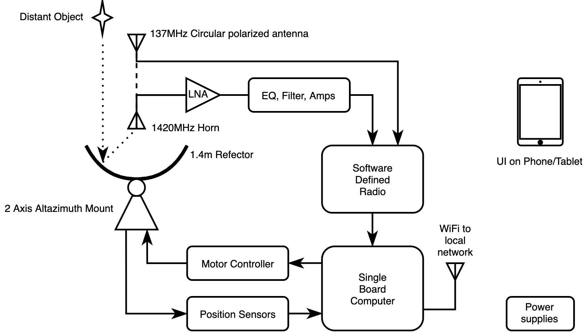
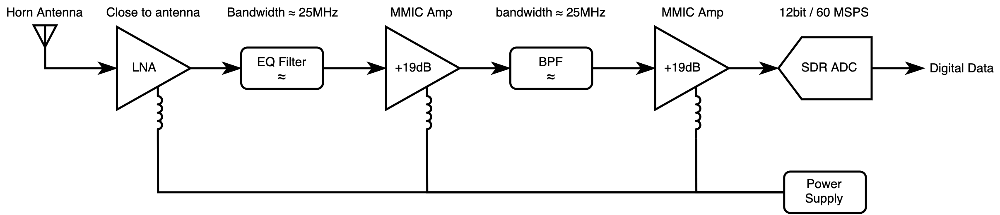

# [creative codename] Radio Telescope

The first generation of radio telescope at Frihamnstorget intended to to be a fun and interactive learning tool for anyone wanting to learn about space.

Users can connect to and control the telescope through a web app and see live data from the telescope, as well as run guided experiments.

### Goal for first experiments:

- Detecting the 1420MHz "Hydrogen Line" and locating the galactic center.
- Connecting to weather satellites and downloading live earth images.
- Detecting known pulsar sources and measuring their rotation speed.

### Features:

- Rooftop single dish antenna design.
- Realtime motorized control of antenna direction to sky.
- Self contained electronics.
- Webserver for controlling and viewing telescope data from phone/tablet.
- Low cost.
- Weatherproof.

## Block diagram

Here are several block diagrams describing the hardware, signal and data flows.

### Hardware level

### RF Signal path

### DSP / Dataflow Pipeline

## Budget 

## Reference

### Skyline height

The figure shows various angles of inclination between the horizon (0°) and various tall structures around the point of the current highest point in Frihamnstorget located at [59.3427791, 18.1176758](https://www.google.com/maps/place/9FFW84V9%2B43/@59.3428125,18.1176875,17z/data=!3m1!4b1!4m5!3m4!1s0x0:0x0!8m2!3d59.3428125!4d18.1176875).

## Licence

**This design is released under the [Creative Commons Attribution 4.0 International](https://creativecommons.org/licenses/by/4.0/) Licence.**

This is a human-readable summary of (and not a substitute for) the [license](https://creativecommons.org/licenses/by/4.0/legalcode).

### You are free to:

**Share** — copy and redistribute the material in any medium or format

**Adapt** — remix, transform, and build upon the material
for any purpose, even commercially.

The licensor cannot revoke these freedoms as long as you follow the license terms.

### Under the following terms:

**Attribution** — You must give appropriate credit, provide a link to the license, and indicate if changes were made. You may do so in any reasonable manner, but not in any way that suggests the licensor endorses you or your use.

**No additional restrictions** — You may not apply legal terms or technological measures that legally restrict others from doing anything the license permits.

### Notices:

You do not have to comply with the license for elements of the material in the public domain or where your use is permitted by an applicable exception or limitation.

No warranties are given. The license may not give you all of the permissions necessary for your intended use. For example, other rights such as publicity, privacy, or moral rights may limit how you use the material.